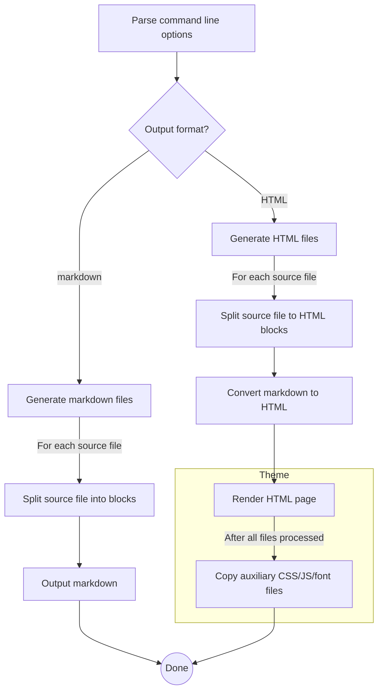

# Literate Programming Makes Documenting C# Code Enjoyable

> Let us change our traditional attitude to the construction of programs: Instead of imagining that 
> our main task is to instruct a computer what to do, let us concentrate rather on explaining to human 
> beings what we want a computer to do.
>
> _Donald Knuth, Computer Journal, 1984_

[Literate programming](https://en.wikipedia.org/wiki/Literate_programming) is an old idea proposed by 
Donald Knuth. Its main principle is that code is written like a book. Knuth argues that programmers
should not focus solely on just writing code, they should also document the thought process that led 
to the chosen implementation. Traditional API documentation describes _what_ the code does, whereas 
literate programming encourages the programmer to document _why_ the implementation looks like it does. 
This not only helps the other programmers understand the code better, but also the author will find it 
easier to revisit the code later on.

Knuth also wrote tools to aid writing code in literate manner. These tools take a file containing
text and code interleaved and produce the source code to be compiled, as well as the "documentation source"
that can be converted to readable format. They are basically preprocessors which operate on the 
same source file, extracting different parts from it. Knuth called this source language `WEB`, hence 
the tools were called "Weave" and "Tangle". Weave produced the documentation in _TeX_ format and Tangle
produced compilable code. The concept is depicted in the picture below.

The same idea can be implemented in other ways too. The most popular method nowadays is to write the 
documentation inside comments and extract it using a post-processor, leaving the compilation process
unchanged. There are newer literate programming tools available that utilize this idea. For example, 
Haskell, Python, and Lisp have tools like this. For .NET there hasn't really been serious attempts to 
make literate programming possible. One of the reasons why literate programming is unfamiliar to most 
programmers is because the tooling has not been available for mainstream development platforms.

Another reason for the literate programming's lack of popularity is its requirement for the programmer
to be proficient in two traits instead of just one. Writing fluent prose can be equally hard to writing 
good code -- and as time consuming as well. Nevertheless, the benefits of having both working software 
and comprehensive documentation always available can sometimes outweigh the costs. Especially when 
writing software such as libraries, tutorials, example programs, etc. whose innards need to be understood
by other programmers. The form in which the documentation is presented can be anything from a book to
a blog post. In fact, there are recent and quite popular books that have been written as literate 
programs; for example the [Physically Based Rendering](http://www.pbrt.org/) book.

In .NET languages the standard way of documenting code is to write XML comments. API documentation
generated from XML comments serves as a reference manual that can be used to find quickly what a 
specific class or method does. When done properly, it is a satisfactory way of describing the correct 
use of an API, or presenting example usage patterns. However, writing XML comments is quite tedious, 
and it requires a lot of discipline to realize their full benefits. XML comments tend to be very verbose 
and repetitive which leads to documentation that is boring to read. In many occasions, reading the
code is faster and easier than reading the documentation. There is little additional information in
the XML comments usually.

## `csweave` - Literate Programming Tool for C#

To make literate programming in C# possible I wrote a tool called `csweave`. The documentation
you are reading right now is generated from its source code. `csweave` reads C# source files 
and extracts text from comment blocks written in [markdown language](https://en.wikipedia.org/wiki/markdown). 
The idea is that you will interleave the documentation in the comments and compile your code 
normally. You can then generate the documentation as either HTML or markdown by running the tool. 

You don't need to use special syntax to annotate the documentation. All comments that are
_not_ in the XML comment format will be extracted and included in the output. This applies
only to multi-line comment blocks. Single line comments starting with `//` are shown as
code in the documentation. 

Literate comments can appear anywhere in the code. The intention is to write the code in small
pieces  as you are describing what it does (and also _why_) in the comments. This way the 
generated documentation becomes more readable and easy to follow.

We will go through the implementation of `csweave` using it as an example on how to write 
programs in literate style.

## Structure of the Program

A high-level flow chart of the program operation is shown below. Click on a box to jump to the
corresponding documentation or select a section from the table of contents in the sidebar.
You can also move to the next and previous section using the navigation buttons on the top and
bottom of the page.

